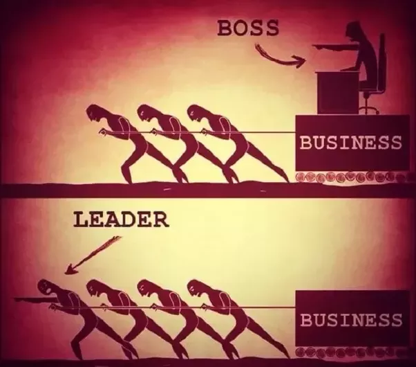

Hi there,  feels like a Sunday afternoon, having had <a href="https://www.youtube.com/watch?v=TEPw00AMvnQ" target="_blank">one night with friends</a> from far away, that joined me for the weekend, in order to celebrate my graduation (ok, that's a separate post, so let's leave it for now).  <h2>Getting to know the event itself </h2>Traveling back in time, I can remember myself reading a tweet from <a href="http://softwaregarden.io/" target="_blank">Patroklos</a> about the 1st global <a href="http://coderetreat.gr/" target="_blank">coderetreat event in Thessaloniki</a>. That time, I was in a rush preparing my thesis for October's presentations, so I just put it in my TODOs list. Unfortunately, the fore-mentioned "rush" was an overkill for the last 3 months (I was trying to combine my <a href="https://github.com/toubou91/thesis-presentation" target="_blank">thesis</a> implementation progress, together with my daily job - did I just say that I will leave the "studies" part out of this post?!), so at that time, my TODOs list maintained greek software management's attitude. Hopefully, some days after, I noticed that there were some cancellations, so, keeping in mind that I had never been in such an event, I'd surely go; I didn't read much about it, I just liked the concept as a whole, so this one would be a new experience (ok, having completed about a year on industry, almost everything that you get exposed on is new) for me.  
 <h2>Reaching the event's place</h2>The event was planned for the 14th of November (Saturday?), so, keeping in my mind that it was a hard week for myself and I, I had to sacrifice Friday's outing for rest. Woke up on time, I reached <a href="http://www.coho.gr/home/">coho</a>, about 9:20, so I had some time to get my breakfast and get awake.
 <h2>Introduction</h2>
<a href="https://twitter.com/ppapapetrou76" target="_blank">Patroklos </a>and <a href="https://twitter.com/nzinas" target="_blank">Nikos</a> were the event organizers. The problem introduced was <a href="http://coderetreat.org/gol" target="_blank">Conway's Game of Life</a>, which had to be approached, regarding the event's concept, following the rules below:

<ul style="text-align:left;"><li>For each session, you have to pair with a different partner.</li><li>At the end of each session the code has to be deleted (, so, for each new session, a completely new project/code template has to be created).</li><li>Each pair must only use 1 pc.</li><li>Each session lasts for 45 minutes; that is, the development process is only 45' minutes.</li></ul>
 <h2>The Sessions</h2>After the introduction of the game, the rules definition and the event's concept, we were said that there were going to be six different sessions, with the first and the last to have a free character, whereas in general, each session would have an increased difficulty level, compared to the previous one. <i>The difficulty level generally depends on the session's</i><i> restrictions set initially.</i>  <h3>Session 1</h3>A fair introduction to the problem from my partner and some trials to adjust the working environment according to the nearest IDE/language preferences that we had in common. Time seemed to be passing by very quickly on this session and that's why I believe it had no challenging character, just an introductory one to the event.  

 <h3>Session 2</h3>Hmmm...restrictions started: "Solve the problem using <a href="http://coderetreat.org/facilitating/activities/ping-pong">TDD's ping-pong approach</a>". One writes the test and the other only tries to get the tests to pass. Obviously, both of them have to refactor when appropriate.  <i>I haven't had prior experience on TDD and I really liked this one; it helps so much for writing cleaner code. </i>  <h3>Session 3</h3>Ok, seems like we 're getting into the meat. What's the next restriction? "Your methods must contain no more than 4 lines of code". Oooh, that one hurt. Or not? After explaining my approach to my partner, it seemed like we had an agreement for this one, but I was still wondering how we could fulfill the requirement. Hopefully, he knew Java 8 and our methods didn't exceed 2 lines.  <i>At this point, let me state the following thought: I have also attended an Oracle's free course for Java 8 lambdas and streams, but this one displayed the difference of using them in production, too. So, I'll surely have to sometime get deeper into it, even for a sample project.</i> <i> </i> <h3>Session 4</h3>"No try/catch, no if/else statements". By default, this one seemed enough challenging, but a big part of the session spent on environment setup and language definitions, as both of us didn't have enough experience with pure PHP. Having had a small amount of time to approach the problem following the restriction set, this one was the hardest one, I would say, as you were obliged to break your code into smaller and smaller functions.  <i>That is, it seemed hard, as we got used to just solving the problem and obviously, the fore-mentioned phrase does not contain keywords like "effectively" or "cleanly".</i> <i>Many of you, readers/devs, would instantly blame your team leaders or software management team and its roots and I wouldn't completely disagree, if the conversation was about project/delivery management or software architecture, <b>but</b> now, it's all about code; it's not a common phenomenon when a supervisor of yours will tell you how to actually write your code, especially here in Greece.</i> <i> </i><i>Nevertheless, we 're still in software and indeed, there is a workaround, for this one, too: for the next time you 're gonna get into some refactoring, if you notice something that would be better changed/written in another way, don't leave it after the upcoming delivery or for tomorrow. Don't try to persuade yourself that you don't currently have enough time for this. Breaking a method to smaller ones, creating a separate package for some common classes or providing some documentation won't last more than 5'.</i> <i> </i><i>And by this you 're not only saving time for yourself (that is, there are many times, that even returning to a code block of yours, written 1 month ago, the "wtf" counter starts incrementign surprisingly), but for the rest ones that will read your code in the future.</i> <i> </i><i>Imagine what would happen if you applied this simple practice in your daily job and if you also persuaded your colleagues to do so:</i>  <ul style="text-align:left;"><li><i>long-term time saving</i></li><li><i>readable and maintainable code</i></li><li><i>less future refactoring</i></li></ul> So, from yesterday, you should start thinking about it, I should start thinking about it, we should start thinking about it, as serious software is a result of good teams and good teams are based not only to team leaders (Figure 1), but on good developers, too. <table align="center" cellpadding="0" cellspacing="0" class="tr-caption-container" style="margin-left:auto;margin-right:auto;text-align:center;"><tbody><tr><td style="text-align:center;"></td></tr><tr><td class="tr-caption" style="text-align:center;">Figure 1. Boss or Leader?</td></tr></tbody></table><h3>Session 5</h3>"No mouse". After hearing this restriction, we simply started laughing, but my initial thought was sth like "how on earth would you benefit of writing cleaner code, from this one?". Ok, it may not be one of the direct "clean code" practices, but it's worth following it while writing code (especially on an IDE), for <a href="http://blog.codinghorror.com/going-commando-put-down-the-mouse/" target="_blank">productivity purposes</a>.  <i>I consider myself knowing enough keyboard shortcuts and I feel lucky for this one, as I had the chance to work closely with guys who liked using them for development. so initially, this one didn't seem as a threat, but when it came to switch to browser, things got difficult enough :).</i> <i> </i> <h3>Session 6</h3>The last session was on the same line as the first one, keeping the character of a free session, but we were also encouraged to apply what whe learned during the day.  <h3>Conclusions</h3>Ok, it was an exhausting day, in conjuction with an exhausting week, too, but <b>in the end of the day, what only matters, are the feelings for it</b> and my feelings according to the event were great. These feelings were also enchanced from the <b>retrospectives </b>that followed each individual session, where we discussed our approaches and how each one them could be better developed.  First off all, I had the chance to come back to social life (after spending the whole summer for the development of my thesis project, in parallel with my daily job), which means meeting new people who have same interests.  Second of all, I believe that all of us leveled up our experience on time management (depending always on the experience of each one), as the event itself pushes you to make the best out of your communication skills, in order to handle team decision making for each session. I'm also grateful that some of my pairs were js guys, as I lately see myself very keen on reading about JavaScript and front-end, in general.  The good thing is that I saw practices that I have never worked with, like TDD: I was really amazed of the way the ping-pong approach works. In addition, seems like Java 8 is here to reduce lines of code for common problems and increase productivity.  Finishing this part and the post itself, I noticed some technical weaknesses of mine, but I won't blame myself for this; instead I will keep them in mind, as points where more practice is required, 'cause I have a way to go as a developer.   Cheers!

